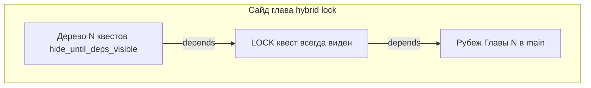
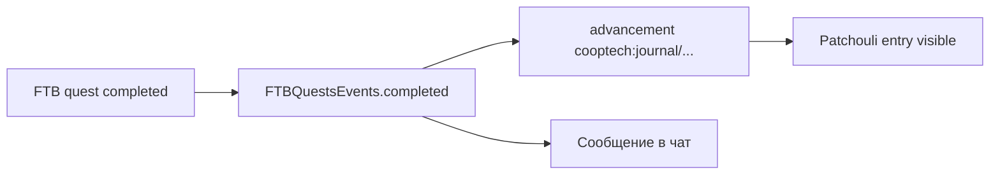

# Квестовое дерево

План доработки FTB Quests CoopTech v1: полноценная книга в стиле ТехноМагии (~50% плотности скринов на главу) — тонкие линии по hover, иконки у каждого квеста, зависимости на всех ветках, гибридная блокировка сайдов и лор в журнале исследований.

---

## Исходное состояние

- **v0.4 scaffold** — 16 глав `main_*` + `side_*` (`quests_build_v1.py`). Preview `tm_*` удалён.
- Оригинал сохранён в [`overrides/config/ftbquests/quests_backup_original/`](../overrides/config/ftbquests/quests_backup_original) — **только как справочник лора/текстов** (Prologue, Ch1–3).
- Моды Draconic / Flux / Silent Gear **ещё не установлены** — нужны для реальных иконок в сайдах.
- **CustomNPCs снят с modlist** — прогрессия только FTB Quests + Журнал + KubeJS.

---

## Целевые показатели (~50% от скринов ТехноМагии)

| Группа | Главы | Квестов (цель) |
|--------|-------|----------------|
| Вступ | Welcome, Guides | 8 + 10 |
| Прохождение | Гл.1–6 | 18 / 22 / 18 / 35 / 22 / 30 |
| Технологии | Thermal, Flux, Network, Draconic | 14 / 8 / 12 / 11 |
| Магия и другое | Kitchen, Arcane, Silent Gear, Apotheosis | 20 / 10 / 9 / 10 |
| **Итого** | **16 вкладок** | **~227 квестов** |

Наполнение: **реальные tasks** (`item`, `kill`, `advancement`), не checkmark-заглушки. Тексты — по [quest-writing-guide.md](quest-writing-guide.md) + лор «Якорь» из backup.

---

## 1. Линии и «стрелки»

### Тоньше линии

В [`overrides/resourcepacks/CoopTechTheme/assets/ftbquests/ftb_quests_theme.txt`](../overrides/resourcepacks/CoopTechTheme/assets/ftbquests/ftb_quests_theme.txt) (и дубликат в `kubejs/assets/`):

```text
dependency_line_thickness: 1.5    # было 4.0
dependency_line_unselected_speed: 0.8
dependency_line_selected_speed: 1.4
```

### Линии только при наведении

FTB Quests: `default_hide_dependency_lines: true` на уровне главы — линии рисуются **при hover/выборе** квеста, не постоянно.

**Изменить** [`scripts/fix_ftb_snbt.py`](../scripts/fix_ftb_snbt.py): сейчас везде принудительно `default_hide_dependency_lines: false`. Новая политика:

| Тип главы | `default_hide_dependency_lines` | `hide_quest_until_deps_*` |
|-----------|--------------------------------|---------------------------|
| Прохождение | `true` (линии по hover) | `false` — дерево видно с замками |
| Сайды | `true` | `hide_quest_until_deps_visible: true` (кроме lock-квеста) |

### Зависимости на всех ветках

- Генератор деревьев: **каждый** квест (кроме intro) имеет `dependencies: [...]`.
- Сайды: радиальные/вертикальные шаблоны (Thermal — кольцо, Kitchen — радиал, Draconic — столб).
- `quest_links` — только декоративные связи без механики.



---

## 2. Иконки у каждого квеста

Правило: **`icon` = предмет из primary task** (или `cooptech:textures/quests/*.png` для лор/gate).

- Обновить [`scripts/generate_cooptech_assets.py`](../scripts/generate_cooptech_assets.py): gate, pool, wave, lock, side_lock PNG.
- Валидатор в build-скрипте: квест без `icon` или с vanilla-placeholder → ошибка.
- После добавления модов: Flux/Draconic/Silent Gear — реальные item ID.
- `fix_ftb_snbt.py` — нормализация `icon: { count: 1, id: "..." }`.

---

## 3. Блокировка сайдов — гибрид

На **каждой** сайд-главе:

1. **`SIDE_LOCK_*`** — один квест, **всегда виден**, `dependencies: [main_chapter_gate_id]`, описание:
   > «Заблокировано. Пройдите **Главу N: …** и завершите рубеж, чтобы открыть ветку.»
2. Остальные квесты: `hide_quest_until_deps_visible: true`, `dependencies` включают `SIDE_LOCK_*` или gate.
3. Глава в сайдбаре **всегда видна** (не `always_invisible`).
4. Глобальный [`data.snbt`](../overrides/config/ftbquests/quests/data.snbt) `lock_message` — короткий fallback.

| Сайд | Открывается после gate |
|------|------------------------|
| Thermal, Kitchen, Arcane, Bestiary | Глава 1 |
| Flux, IE | Глава 2 |
| Network (AE2) | Глава 3 |
| Mekanism, EnderIO, Apotheosis | Глава 4 |
| Silent Gear | Глава 5 |
| Draconic | Глава 6 |

---

## 4. Журнал исследований + лор

Цепочка как в [`journal_quest_unlocks.js`](../overrides/kubejs/server_scripts/journal/journal_quest_unlocks.js):



**Добавить:**

- Advancements: `overrides/data/cooptech/advancements/journal/` — gate/finale глав 1–6, unlock сайдов, welcome/guides.
- Patchouli: новые entries в [`patchouli_books/expedition_journal/`](../overrides/patchouli_books/expedition_journal) — «Хроника» + «Ветки модов».
- `JOURNAL_UNLOCKS` — новые quest ID (схема `B1xx...`).
- Тексты лора — адаптация из backup Prologue/Ch1–3.

---

## 5. Инфраструктура контента (с нуля)

### Файловая структура

Заменить `tm_*` на:

- `main_00_welcome.snbt` … `main_07_finale.snbt`
- `side_thermal.snbt`, `side_flux.snbt`, … (8 сайдов)
- [`chapter_groups.snbt`](../overrides/config/ftbquests/quests/chapter_groups.snbt) — 4 группы

### Генератор

[`scripts/quests_build_v1.py`](../scripts/quests_build_v1.py):

- JSON **manifest** на главу: title, icon, task, deps, x, y, shape.
- Шаблоны layout: `radial`, `grid_3x3`, `vertical`, `pool_gate_wave`.
- Экспорт в SNBT + прогон `fix_ftb_snbt.py`.

### Моды

Добавить в [`modlist.txt`](../modlist.txt) + [`scripts/install_mods.py`](../scripts/install_mods.py):

- Flux Networks, Draconic Evolution (+ BrandonsCore, CodeChickenLib), Silent Gear (+ Silent Lib)
- Скопировать jar в TLauncher `Мой мод пак/mods/` (sync или опция `--mods` в `sync_to_tlauncher.py`)

---

## 6. Порядок работ (волнами)

### Волна A — UX и каркас

1. Theme: тонкие линии + `default_hide_dependency_lines: true`
2. Обновить `fix_ftb_snbt.py`
3. `quests_build_v1.py` — каркас 16 глав + lock-квесты на сайдах
4. Установить 3 мода

### Волна B — Прохождение

5. Welcome + Guides (18 квестов, item icons)
6. Главы 1–3 (54 квеста) — лор из backup + pool/gate 2/4
7. Journal + Patchouli для gates 1–3

### Волна C — Прохождение позднее + сайды tech

9. Главы 4–6 (87 квестов)
10. Thermal, Flux, Network, Draconic — полные деревья
11. Journal для gates 4–6 и tech-сайдов

### Волна D — Сайды magic/other

12. Kitchen, Arcane, Silent Gear, Apotheosis
13. Финальный `sync_to_tlauncher.py` + тест в игре

---

## 7. Критерии приёмки (чеклист в игре)

- [ ] Линии **тонкие**, видны **только при наведении** на квест
- [ ] У **каждого** квеста есть иконка предмета (не пустой/фиолетовый блок)
- [ ] Сайд до рубежа: видна вкладка + lock-квест с текстом «пройдите Главу N»
- [ ] После рубежа: появляется полное дерево сайда с зависимостями
- [ ] Плотность глав ~половина скринов ТехноМагии (не 5 квестов на вкладку)
- [ ] Завершение рубежей открывает записи в **Журнале экспедиции**

---

## Чеклист задач

| ID | Задача | Статус |
|----|--------|--------|
| ux-lines-theme | Тема + fix_ftb_snbt.py | done |
| build-generator | quests_build_v1.py + manifest | done |
| scaffold-chapters | 16 глав, lock-квесты, quest ID | done |
| add-mods-jars | Flux, Draconic, Silent Gear + deps | pending |
| content-main-1-3 | Welcome, Guides, Главы 1–3 (~72) | in_progress |
| content-main-4-6 | Главы 4–6 (~87) | scaffold |
| content-sides | 8 сайд-веток (~84) | scaffold |
| journal-lore | Advancements + Patchouli + KubeJS | in_progress |
| sync-test | sync_to_tlauncher + тест в игре | pending |

---

## Риски

- **~227 квестов** — контент пишется волнами; генератор без ручных текстов даст скелет.
- **fix_ftb_snbt** конфликтует с hover-линиями — править скрипт перед каждым sync.
- **FTB read-only SNBT** после sync — правки только в `overrides/`, потом `sync_to_tlauncher.py`.

---

## Связанные документы

- [quest-writing-guide.md](quest-writing-guide.md)
- [chapter-structure.md](chapter-structure.md)
- [quests-status.md](quests-status.md)
